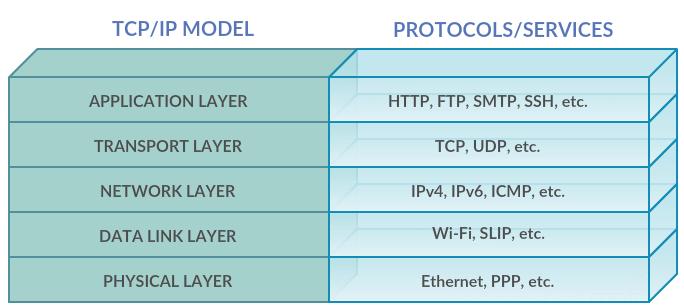

# 🛜 Network

Computer networks are a collection of computers connected together to share resources such as files, printers and Internet access. They are essential for communication and collaboration between people all over the world.

## 📡 Types of Networks

- **Local Area Network (LAN)**: A computer network used to interconnect devices in a limited geographical area, such as a home, office or university campus. It is generally used to share resources, such as printers and internet connection, between the connected devices.

- **Metropolitan Area Network (MAN)**: This is a computer network that covers a metropolitan area, such as a city or urbanized region. The MAN is used to allow communication between several local networks in a specific area.

- **Wide Area Network (WAN)**: This is a computer network that covers a larger geographical area, such as a city, state or country. It is commonly used to connect several local networks and allow communication between them. WAN networks are often provided by Internet Service Providers (ISPs).

- **Personal Area Network (PAN)**: This is a computer network used to connect personal devices, such as smartphones, tablets and laptops, in a small area, usually within a range of a few meters. It is often used to share files, print documents and synchronize devices.

- **Body Area Network (BAN)**: Body Area Network is a wireless communication network that connects portable electronic devices close to the human body. BAN networks are used for a variety of purposes, including medical monitoring, fitness and entertainment.

## 🌐 Network topologies

- **Bus**: In this topology, all the network devices are connected to a single cable, called the backbone. The devices communicate by sending electrical or optical signals through the shared cable. A common example of this topology is Ethernet, where devices are connected to a central hub or switch via network cables.

- **Star**: In this topology, each device on the network is connected individually to a central switch or hub. The switch or hub acts as the central connection point, facilitating communication between the devices. If one device fails, the other devices are not affected, as communications are routed through the switch or hub. The star topology is very common in local area networks (LANs) and is widely used in office and residential environments.

- **Ring**: In this topology, the network devices are connected in a closed loop, forming a ring. Each device is connected to two neighboring devices, forming a chain of connections. Data circulates in the ring from one device to another until it reaches the desired destination. This topology is less common today and is usually found in older or specific networks.

- **Mesh**: In this topology, each device on the network is connected to all the other devices on the network. Each device acts as an access point for other devices, allowing direct communication between them. This topology is very redundant and offers high reliability, because if one communication path fails, the data can be routed through other available paths. However, this topology requires a large number of cables and network ports, making it more expensive and complex to implement.

- **Tree (Hierarchical)**: This is a combination of star and bus topologies. Devices are organized into hierarchical levels, with a central node connecting different subtrees. It offers scalability and ease of expansion.

## 📟 Network Devices and Concepts

### Switch
A switch is a device that connects several computers in a local area network (LAN). It is responsible for routing data between the computers on the LAN. A switch is more intelligent than a hub. It keeps a table of MAC addresses and uses this table to direct data only to the correct destination device.

### Hub
A hub is a device that connects several computers in a LAN. It is similar to a switch, but not as efficient.  A hub simply repeats the data it receives from one device to all the other devices on the network. It has no ability to make decisions based on the MAC addresses of the devices.

### Router
A router is a device that connects two or more different networks. It is responsible for routing data between networks, taking into account the IP address of the destination.

### Gateway
A gateway is a device that connects two different networks. It is responsible for translating the communication protocols between the networks.

### Access Point
Um ponto de acesso (AP) é um dispositivo que permite que dispositivos sem fio se conectem a uma rede. Ele transmite um sinal de rádio que os dispositivos sem fio podem usar para se conectar à rede.

### Intranet
It is a private computer network that uses Internet technologies to share information, resources and services within an organization. Generally only accessible to employees or authorized members of the organization.

### Extranet
It is an extension of the intranet that allows limited sharing of information, resources and services with parties outside the organization, such as customers, suppliers, partners or other authorized entities. It is a controlled area that extends collaboration beyond the internal boundaries of the organization.

### Edge Computing
It is a distributed computing paradigm that aims to process and store data closer to the sources of generation and consumption, i.e. at the "edge" of the network, instead of sending all the data to a centralized data center or to the cloud. This is done to reduce latency, improve application performance and reduce the load on the network.
Edge Computing is particularly relevant in scenarios where latency is critical, such as Internet of Things (IoT) applications, video streaming, autonomous vehicles, augmented reality (AR) and virtual reality (VR), among others.

### Software Defined Networks (SDN)
SDN enables more centralized and flexible control of networks by separating the control layer from the data layer.
This makes it easier to automate, quickly provision resources and optimize network performance.
SDN is essential for cloud computing, 5G networks and the Internet of Things (IoT).

### Network Functions Virtualization (NFV)
It is an approach that aims to virtualize and disaggregate network functions traditionally carried out by dedicated hardware, transforming them into software that can be run on generic hardware infrastructure. In other words, NFV seeks to migrate network functions such as routing, firewalling, load balancing and others from physical devices to virtualized environments.

### Intent-Defined Networks (IBN)
IBN is an approach to networking that focuses on the intent of the user or administrator, rather than manually configuring network devices. With IBN, policies are defined at a high level of abstraction and the network is automatically configured to meet these intentions, increasing automation, simplifying operations and reducing human error.

## 📦 OSI

The **OSI (Open Systems Interconnection)** model is divided into seven layers, each with its own specific function.

- **Physical layer**: the physical layer is responsible for the transmission of bits on the network. It defines the format of the bits and the physical medium on which they are transmitted.

- **Data link layer**: the data link layer is responsible for communication between adjacent devices on the network. It defines the format of data packets and the mechanism for controlling access to the medium.

- **Network layer**: the network layer is responsible for routing data on the network. It defines the format of the network addresses and the routing algorithm.

## 📦 TCP/IP (5 layers)

TCP/IP is an open standard that defines the protocols and protocols for communication between devices on a network. It is also commonly used in the context of the Internet.

- **Physical Layer**: Deals with the physical transmission of bits over the physical transmission medium.

- **Data Link Layer**: It transfers data between devices on the same local network, managing access to the medium, error detection, flow control, etc.

- **Network Layer**: It defines the format of the network addresses and the routing algorithm.

- **Transport Layer**: It defines the format of data packets and the mechanism for controlling access to the medium.

- **Application Layer**: It defines the format of the application layer and the protocols for communication between devices on the same network.