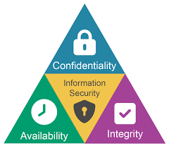

# Information Security Principles

## 🔼 The Triad

	

### 1. Confidentiality
It ensures that information is accessible only to those authorized to have access, and therefore protects personal or corporate information from being accessed by unauthorized persons.

### 2. Integrity
Ensures that information is accurate and complete, and has not been altered in an unauthorized way. This means that data must be kept consistent, accurate and reliable throughout its lifecycle.

### 3. Availability
Ensures that information and associated resources are available to authorized users when needed.

---
---
In addition to these three principles, other concepts are also considered important in information security, such as:
- **Authenticity**: It guarantees that the parties involved in a communication are who they say they are and that each entry is authenticated and verifiable.
- **Non-repudiation**: It ensures that once an action has been taken, the plaintiff cannot deny authorship.

## ⚖️ Information Security Policies 
Information Security Policies are formal and comprehensive guidelines established by an organization to protect its information assets against security threats and risks. These policies are based on norms, regulations and recognized standards, such as **ISO 27001**, NIST, among others. 
They define the rules, responsibilities, procedures and practices that must be followed to guarantee the **confidentiality**, **integrity** and **availability** of data, as well as establishing actions to prevent security incidents and respond to them in an appropriate manner.

**They must be communicated and disseminated to all members of the organization.**

 Effective communication of these policies is essential to ensure that all employees understand their responsibilities, obligations and the practices required to maintain the security of information assets.
- It must be communicated to EVERYONE involved. 
- It is the responsibility of EVERYONE involved too.

### Audit
An information security audit is a formal, structured examination conducted to assess whether an organization's security controls are adequate and effective, and whether they comply with internal policies, security standards (such as ISO 27001) and legal regulations. 

During an audit, evidence is collected and analyzed to verify that information systems are protected against unauthorized access, alteration, destruction and that security procedures are followed. 

Audits can be internal, carried out by employees of the organization itself, or external, carried out by independent auditors, and their ultimate aim is to ensure the integrity, confidentiality and availability of information.

## 🔐 Authentication and access control
**Something you know**: Passwords, PINs or answers to security questions.

**Something you own**: Physical devices such as security tokens, smart cards or hardware keys.

**Something you are**: Unique physical or behavioral characteristics, such as fingerprints, facial recognition or typing analysis.

Multifactor authentication combines two or more of these factors to increase system security.
- **2FA, or Two-Factor Authentication**, is a security method that requires two different forms of identity verification before granting access to an account or system. It usually consists of combining something the user knows (such as a password) with something the user has (such as a mobile device) to increase information security and reduce the risk of unauthorized access.
- **Multi-factor authentication (MFA)**, combining 2 or more factors.
- **Role-Based Access Control (RBAC)**: RBAC is an access control method that assigns permissions based on the functions or roles that users play in the organization. This simplifies access administration as rights are grouped by role.
- **Policy-Based Access Control (PBAC)**: ABAC is a more flexible method that considers a variety of user attributes, context and resources before allowing or denying access. This allows for finer granularity in access control.

**Segregation of Duties**: This principle involves separating tasks and responsibilities for different users or roles, reducing the risk of abuse or fraud.